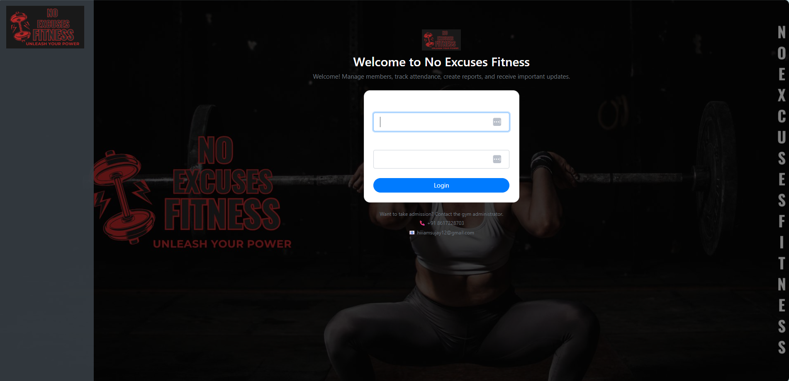
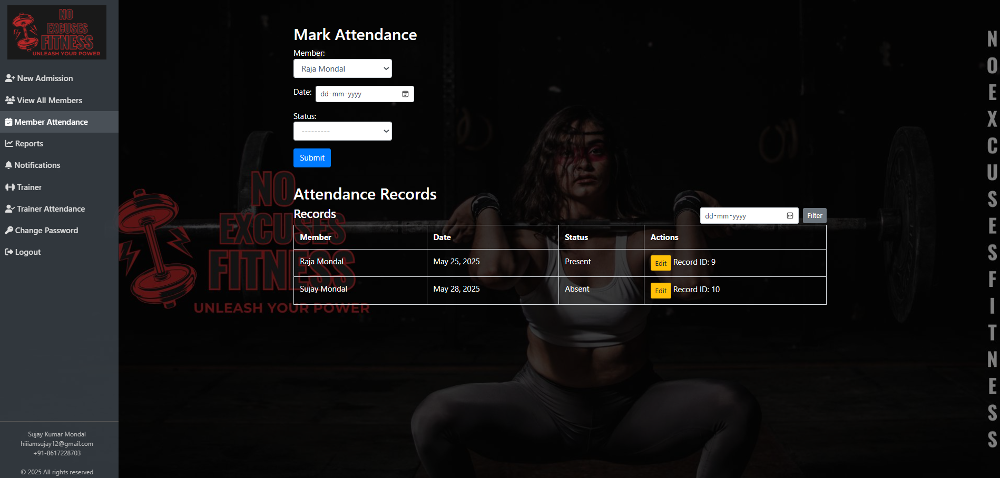
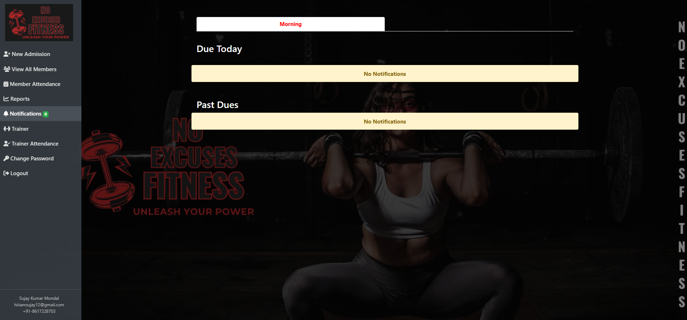
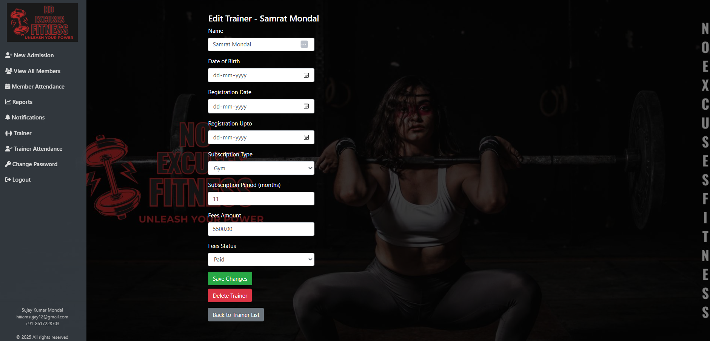

# Django Gym Member Manager

A modern, user-friendly web application for managing gym memberships, payments, attendance, trainers, and more. Built with Django, this project streamlines gym administration, making it easy to track members, handle payments, generate reports, and manage trainers—all from a clean, responsive interface.











---

## Features

- **Member Management:** Add, edit, view, and delete gym members with ease.
- **Attendance Tracking:** Record and monitor member attendance.
- **Payment Management:** Track payments, due dates, and generate payment reports.
- **Trainer Management:** Manage trainers, and edit trainer details.
- **Reporting:** Generate detailed reports on admissions, payments, and attendance. Export reports to Excel.
- **Notifications:** Send and view notifications for important events.
- **User Authentication:** Secure login system with password management.
- **Customizable Dashboard:** Change wallpapers and personalize the admin dashboard.
- **Responsive UI:** Clean, mobile-friendly interface using Bootstrap.

---


---

## Getting Started

### Prerequisites

- Python 3.6+
- pip (Python package manager)
- (Optional) Virtual environment tool (e.g., `venv` or `virtualenv`)

### Installation

1. **Clone the repository:**
    ```sh
    git clone https://github.com/SujayKumarMondal/NoExcusesFitness
    cd NoExcusesFitness
    ```

2. **Install dependencies:**
    ```sh
    pip install -r requirements.txt
    ```

3. **Apply migrations:**
    ```sh
    python manage.py migrate
    ```

4. **Create a superuser:**
    ```sh
    python manage.py createsuperuser
    # Follow the prompts to set up your admin account
    ```

5. **Run the development server:**
    ```sh
    python manage.py runserver
    ```

6. **Access the application:**
    - Open your browser and go to [http://127.0.0.1:8000/] / [http://127.0.0.1:<your defined port>/](http://127.0.0.1:8000/)

---

## Usage

- **Login:** Use your admin credentials to log in.
- **Dashboard:** View statistics, quick links, and notifications.
- **Members:** Add new members, view all members, and manage their details.
- **Attendance:** Mark and review attendance records.
- **Payments:** Record payments and view payment history.
- **Reports:** Generate and export reports for admissions and payments.
- **Trainers:** Manage trainer profiles and records.
- **Settings:** Change your password and customize the dashboard appearance.

---

## Screenshots

> See the images above for a preview of the main features and UI.

---

## License

This project is licensed under the [MIT License](LICENSE).

---

## Contributing

Contributions are welcome! Please open issues or submit pull requests for improvements and bug fixes.

---

## Acknowledgements

- Built with [Django](https://www.djangoproject.com/)
- UI powered by [Bootstrap](https://getbootstrap.com/)
- Icons from [Font Awesome](http://fontawesome.io/)

---

## Contact

For questions or support, please contact [Sujay](mailto:hiiiamsujay12.com).